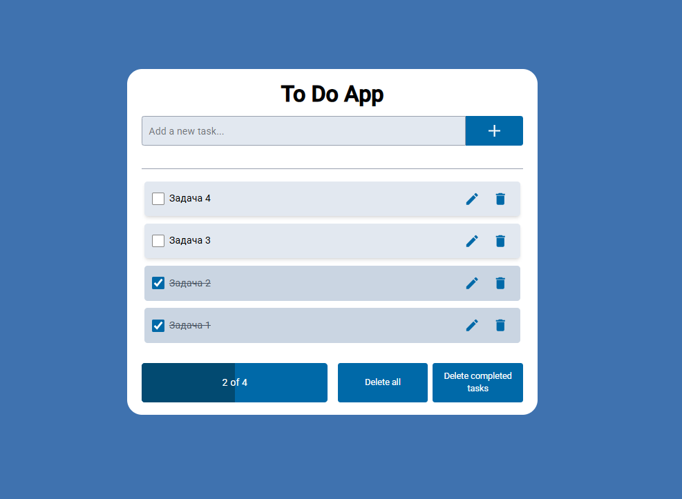

# To Do App

Простой и адаптивный To Do список, реализованный на **React**, **TypeScript**, **Zustand** и **Tailwind CSS**.

---

## Функциональность

- Добавление новых задач
- Редактирование задач
- Отметка задач как выполненные
- Удаление задач (по одной, всех или только выполненных)
- Сохранение состояния через `localStorage`
- Прогресс-бар выполнения
- Адаптивный дизайн для мобильных и десктопов
- Удобная структура компонентов с разделением логики и UI

---

## Технологии

- **React 18**
- **TypeScript**
- **Zustand** — для глобального состояния задач
- **Tailwind CSS** — для стилизации
- **React Icons** — для иконок
- **Vite** — в качестве сборщика

---

## 📁 Структура проекта

src/
│
├── app/
│ └── Home.tsx # Главная страница
│
├── entities/
│ └── todo/
│ ├── ui/ # UI-компоненты (InputPlus, InputTask, FooterBlock)
│ ├── features/ # Контейнеры и логика (InputTaskContainer, FooterLogic)
│ ├── model/ # Zustand store, helpers и types
│ ├── types.ts # Интерфейсы и типизация
│
├── shared/
│ └── ui/Modal.tsx # Общий модальный компонент